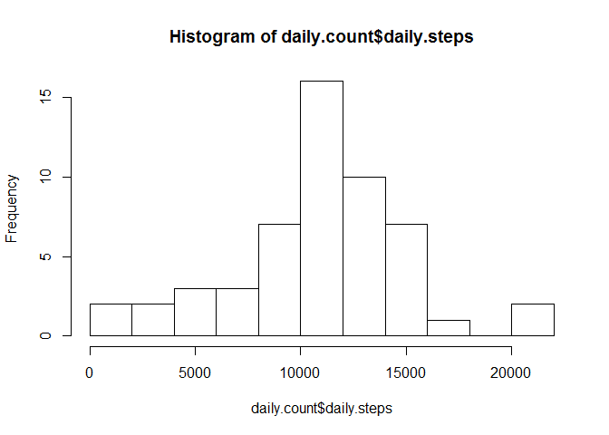
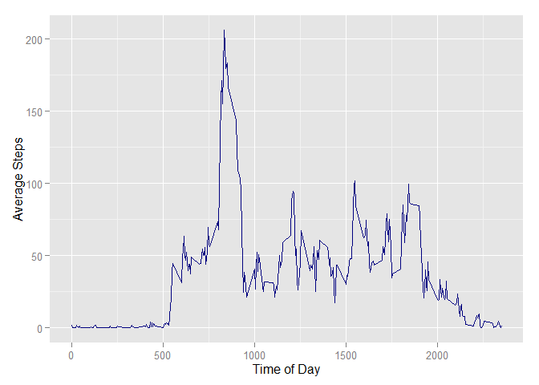
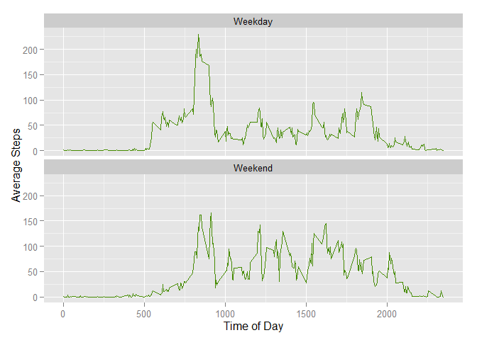

# Reproducible Research: Peer Assessment 1
This is the first assignment for Reproducible Research. It contains exploratory data analysis
on personal movement data. From the assignment description:

>It is now possible to collect a large amount of data about personal movement using activity monitoring devices such as a Fitbit, Nike Fuelband, or Jawbone Up. These type of devices are part of the “quantified self” movement – a group of enthusiasts who take measurements about themselves regularly to improve their health, to find patterns in their behavior, or because they are tech geeks. But these data remain under-utilized both because the raw data are hard to obtain and there is a lack of statistical methods and software for processing and interpreting the data.

>This assignment makes use of data from a personal activity monitoring device. This device collects data at 5 minute intervals through out the day. The data consists of two months of data from an anonymous individual collected during the months of October and November, 2012 and include the number of steps taken in 5 minute intervals each day.

## Loading and preprocessing the data
The following packages are required:


```r
if (require(reshape2) == FALSE) {
  install.packages('reshape2')
  library(reshape2)
}
```

```
## Loading required package: reshape2
```

```r
if (require(dplyr) == FALSE) {
  install.packages('dplyr')
  library(dplyr)
}
```

```
## Loading required package: dplyr
```

```
## 
## Attaching package: 'dplyr'
```

```
## The following object is masked from 'package:stats':
## 
##     filter
```

```
## The following objects are masked from 'package:base':
## 
##     intersect, setdiff, setequal, union
```

```r
if (require(ggplot2) == FALSE) {
  install.packages('ggplot2')
  library(ggplot2)
}
```

```
## Loading required package: ggplot2
```

```r
if (require(timeDate) == FALSE) {
  install.packages('timeDate')
  library(timeDate)
}
```

```
## Loading required package: timeDate
```

First, I load the data into memory from the data source. Aside from the NA records, it is in
a clean format and requires no preprocessing.


```r
temp <- "~/activitydata.zip"
activity.data <- 'https://d396qusza40orc.cloudfront.net/repdata%2Fdata%2Factivity.zip'
download.file(activity.data,temp,method="curl")
```

```
## Warning: running command 'curl "https://d396qusza40orc.cloudfront.net/
## repdata%2Fdata%2Factivity.zip" -o "C:/Users/drummond/Documents/
## activitydata.zip"' had status 127
```

```
## Warning in download.file(activity.data, temp, method = "curl"): download
## had nonzero exit status
```

```r
steps.data <- read.csv(unz(temp, "activity.csv"), stringsAsFactors = FALSE)
```

## What is mean total number of steps taken per day?
First, calculate the total number of steps per day.


```r
by.date <- group_by(steps.data, date)
daily.count <- summarise(by.date, daily.steps = sum(steps))
head(daily.count)
```

```
## Source: local data frame [6 x 2]
## 
##         date daily.steps
## 1 2012-10-01          NA
## 2 2012-10-02         126
## 3 2012-10-03       11352
## 4 2012-10-04       12116
## 5 2012-10-05       13294
## 6 2012-10-06       15420
```

Now, make a histogram of the total number of steps taken per day.


```r
hist(daily.count$daily.steps, breaks = 10)
```

\

Calculate and report the mean and median of the total number of steps taken per day.


```r
mean(daily.count$daily.steps, na.rm = TRUE)
```

```
## [1] 10766.19
```

```r
median(daily.count$daily.steps, na.rm = TRUE)
```

```
## [1] 10765
```

## What is the average daily activity pattern?

I do this by creating a time series plot for the 5 minute intervals along the x-axis, and the 
average number of steps taken during that time interval, plotted on the y-axis.


```r
by.time.interval <- group_by(steps.data, interval)
time.average <- summarise(by.time.interval, average.steps = mean(steps,  na.rm = TRUE))
ggplot(time.average, aes(interval, average.steps))+ geom_line(color="navyblue")+ ylab("Average Steps") + xlab("Time of Day") 
```

\

It looks like there's a spike in the number of steps taken during the morning. Which 5-minute interval, on average across all the days in the dataset, contains the maximum number of steps?


```r
most.steps <- time.average[time.average$average.steps == max(time.average$average.steps),]
print(most.steps)
```

```
## Source: local data frame [1 x 2]
## 
##   interval average.steps
## 1      835      206.1698
```

## Imputing missing values
There are a lot of incomplete rows in the data. In order to create cleaner calculations, the 
following data set uses the average of the values for an interval across all days for missing values for that interval.  

To get the total number of NA values in the dataset:


```r
nrow(steps.data[is.na(steps.data$steps) ,])
```

```
## [1] 2304
```

Then create and update a new dataset with the mean values substituted for the NAs.


```r
steps.transformed <- merge(steps.data, time.average)

rows = 1
changes = 0
while(rows < nrow(steps.transformed)){
  if(is.na(steps.transformed[rows,2])){
    steps.transformed[rows,2] <- steps.transformed[rows,4]
    changes = changes + 1
  }
  rows = rows + 1
}
print(changes)
```

```
## [1] 2303
```

```r
nrow(steps.transformed[is.na(steps.transformed$steps) ,])
```

```
## [1] 1
```

Now we can compare a histogram of the total number of steps taken each day, as well as the mean and median to confirm that there are no significant differences introduced by removing the NAs versus using the average values.


```r
hist(daily.count$daily.steps, breaks = 10)
```

\

```r
mean(daily.count$daily.steps, na.rm = TRUE)
```

```
## [1] 10766.19
```

```r
median(daily.count$daily.steps, na.rm = TRUE)
```

```
## [1] 10765
```

The histogram, mean, and median are identical to the previous calculations.

## Are there differences in activity patterns between weekdays and weekends?
The first step is to divide the data between weekdays and weekends. For this step, I used the timeDate package.


```r
steps.transformed$weekday = 0
rows = 1
while(rows <= nrow(steps.transformed)){
  if(isWeekday(as.Date(steps.transformed[rows,3]))){
    steps.transformed[rows,5] <- "Weekday"
  } else {
    steps.transformed[rows,5] <- "Weekend"
  }
  rows = rows + 1
}
```

Finally, to compare the average activity for weekday and weekends, the data need to be aggregated and plotted accordingly.


```r
by.interval <- group_by(steps.transformed, interval, weekday)
interval.average <- summarise(by.interval, average.steps = mean(steps,  na.rm = TRUE))


ggplot(interval.average, aes(interval, average.steps))+ geom_line(color="chartreuse4")+ ylab("Average Steps") + xlab("Time of Day") +facet_wrap(~weekday, nrow=2)
```

\
